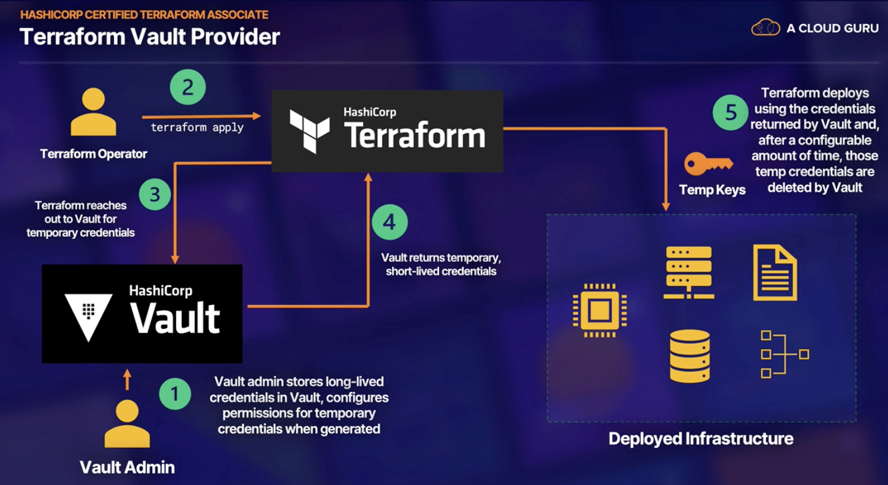
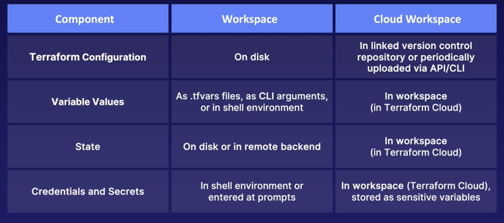

# Terraform

* It allows you to manage infrastructure with configuration files rather than GUI.
* It allows to build, change and manage infrastructure in a safe, consistent, and repeatable way by configurations that 
  we can version, reuse, and share.
* Terraform is a cloud-agnostic, it means terraform doesn't care what cloud or infrastructure deployment method we are
  using.
* It works with a long list of cloud providers, database providers and much more.

## Terraform advantages:
* It can manage infrastructure on multiple cloud platforms.
* The human-readable configuration language helps you write code quickly.
* It allows tracking the resource changes throughout deployment.
* We can commit configurations to version control to safely collaborate on infrastructure.
* It interacts with the resources using API
* To initialize the terraform, run the command `terraform init`.
  It initializes a terraform directory by downloading
  required modules and plugins.
* You can check the changes before applying them using dry-run feature by running the command `terraform plan`
* To apply the changes run the command `terraform apply`
* To destroy terraform, run the command `terraform destroy`

## Installation
* Run the command to install all homebrew packages of hashicorp on Mac using brew `brew tap hashicorp/tap`.
* Run the command to install terraform `brew install hashicorp/tap/terraform`

## Initialization
* Move to that directory and create a `main.tf` file and provide the configurations to create a `t2.micro instance`.
**main.tf**
```hcl
# terraform configuration block
terraform {
  required_providers {
    aws = {
      source = "hashicorp/aws"
      version = "~> 4.16"
    }
  }

  required_version = ">= 1.2.0"
}

# Configure the region
provider "aws" {
  region = "us-east-1"
}

# creating instance with tag name Terraform_Demo
resource "aws_instance" "app_server" {    #"aws_instance": resource_type; "app_server": resource_name
  ami = "ami-0e731c8a588258d0d"
  instance_type = "t2.micro"
  
  tags = {
    Name = "Terraform_Demo"
  }
}
```
* To refer to the instance created above in other parts of the configuration, you have to use the id `aws_instance.app_server` 
* To init the terraform project run the command `terraform init`, which downloads a plugin called provider that lets
  terraform interact with Docker.
* The `terraform fmt` command automatically updates the configurations in the current directory for readability.
* The `terraform validate` command validates that configuration is syntactically valid.
* After we apply the configuration, terraform writes the changes into terraform.tfstate file. We can see the content of
  the file using the command `terraform show`.
* To list the resources in our project, we can run the command `terraform state list`

## Variables
* you can assign the variables created in the `variables.tf` file in the configuration.
* Create a new file `variables.tf` and write the required variables inside it as shown below.
```hcl
variable "instance_name" {
  description: "Name of the instance"
  type: string
  default: "Terraform_Demo"
}
```
* Now, we can refer this variable `instance_name` in our main.tf file as 
```
tags = {
  Name = var.instance_name
 }
```
* We have to provide the value for the variable while running the apply command as `terraform apply -var "instance_name=New_Terraform_Name`
* We can write up all the variables into a file with extension .tfvars and specify that file while applying to terraform
  using the flag `--var-file`.
```hcl
# terraform.tfvars
resource_tags = {
  project = "project_name"
  environment = "dev"
  owner = "me@example.com"
}

instance_type = "t3.micro"
instance_count = 3
```
* From the above snippet, we can refer to the variables as `var.resource_tags["project"]`.

## Outputs
* We can specify the outputs that we need using the `outputs.tf` file.
* Define the required outputs in thea outputs.tf file.
```hcl
output "instance_id" {
  description = "ID of the ec2-instance"
  value = aws_instance_app_server.id
}
```
* To print the output variables run the command `terraform output`

## Modules
* Modules help in organizing the configuration by making it easier to navigate, understand, and update the
  configuration by keeping related parts of the project together.
* Modules are reusable.
* The directory that consists of terraform files is known as a module.
* When you run the terraform commands from the module, the CLI considers it as root module.
* We can call the modules from another module using the **module block**.
* Module called by other configuration is sometimes known as **child module**.
* Modules can either be local or remote such as terraform cloud, version control systems, terraform registry.

## Built-in functions

* Terraform comes pre-packaged with functions to help us transform and combine values.
* User-defined functions are not allowed—Only built-in ones.
* General syntax: `function_name(arg1, arg2)`
* Built-in functions are extremely useful in making terraform code dynamic and flexible.
```hcl
variable "project_name" {
  type = string
  default = "prod"
}

resource "aws_vpc" "my-vpc" {
  cidr_block = "10.0.0.0/16"
  tags       = {
    Name = join("-", ["terraform", var.project-name])
  }
}
```
* Some of the built-in functions are 
  * `file : to insert files into resources`
  * `max : max integer value`
  * `flatten : to create a singular list of provided set of lists.`
  * `timestamp : returns the UTC timestamp`
  * `join : joins the values provided in the list using the provided seperator`
  * `contains : returns true or false based on the presence of string in the list.` , `contains(["acloud", "test"], "test")`

## Complex variable types

### Structural

* It allows only different types defined under the variable
* Example: 
```hcl
variable "instructions" {
  type = object({
    name = string
    age  = number
  })
}
```
### Dynamic type—any
* It allows only one type inside the list.
* 
```hcl
variable "data" {
  type = list(any)
  default = [1, 147, 123]
}
```
## Terraform Dynamic Blocks

* It constructs repeatable nested configuration blocks inside Terraform resources.
* Used to make code look cleaner.
* Supported within 
  * Resources
  * data
  * provider
  * provisioner

```hcl

variable "rules" {
  default = [
    {
      port = 80
      proto = "tcp"
      cidr_blocks = ["0.0.0.0/0"]
    },
    {
      port = 22
      proto = "tcp"
      cidr_blocks = ["1.2.3.4/32"]
    }]
}

resource "aws_security_group" "my-sg" {
  name = "my-aws-security-group"
  vpc_id = aws_vpc.my-vpc.id
  dynamic "ingress" {
    for_each = var.rules
    content {
      from_port  = ingress.value["port"]
      to_port    = ingress.value["port"]
      protocol   = ingress.value["proto"]
      cidr_block = ingress.value["cidr_blocks"]
    }
  }
}

```

## Terraform Taint

* It forces the resource to be deleted and recreated in the next apply command.
* To taint the resource we need to mention the resource_address within your terraform code `terraform taint aws_instance.{instance_name}`
* For the terraform version 0.15.2 or later `terraform apply -replace {resource_address}` is being used instead of taint.


**Use cases**
* To run the provisioner commands.
* Replace misbehaving resources forcefully.

## Terraform import

* When we need to map the resource with the real world resource, we will use the import command.
* The syntax to use the import command is `terraform import resource_address id`
* The id is the real world resource id. For example, if we need to import an instance, the command will look like this
  * `terraform import aws_instance.{instance_name} {real_world_instance_id}`

**Use cases**
* When we don't want to create a new resource, we will use import command and map it in the terraform code.
* When we need to work with the existing resources.

## Terraform workspaces

* Terraform workspaces are alternate state files within the same working directory.
* Terraform starts with a single workspace always called default. It cannot be deleted.
* To create a new workspace `terraform workspace new {workspace_name}`
* To select an existing workspace to work on `terraform workspace select {workspace_name}`
* State files of workspaces other than the default will be stored in the `terraform.tfstate.d` directory.

**Use cases**

* To test changes using a parallel, distinct copy of infrastructure.
* Each workspace will have its own state file.
* It can be modeled against branches in version control such as a Git.
* Workspaces are meant to share resources and to help developers to work on their own environment without touching the default state file.
* To access the workspace name we can use `${terraform.workspace}` variable.
* The below example checks the workspace, and if the current workspace is default, it spins up five instances, if it is not, it only spins up one instance.
```hcl
resource "aws_instance" "example" {
  count = terraform.workspace == "default" ? 5 : 1
  # Other arguments
}
```
* We can also assign the workspace name to the S3 bucket as shown below
```hcl
resource "aws_s3_bucket" "example" {
  bucket = "myxyz123-${terraform.workspace}"
  acl = "private"
}
```

## Debugging Terraform

* We can log terraform using the environment variable `TF_LOG`.
* The TF_LOG can be set to the `TRACE, DEBUG, INFO, WARN, ERROR`.
* TRACE is the most verbose level of logging and the most reliable one.
* To persist logged output, use the `TF_LOG_PATH` environment variable.
```Bash
export TF_LOG=TRACE
export TF_LOG_PATH=./terraform.log 
```

## Terraform Cloud

**Sentinel**

* Sentinel has its own language `sentinal language`.
* Designed to be approachable by non-programmers.
* Enforces restrictions on our terraform code.
* It runs after terraform plan and before terraform apply.
* We can apply sentinel policies against the terraform code. For example, we can block a dev user to deploy into prod space.
* Easier understanding and better collaboration.
* It allows the sentinel policies to be version control and share across the organization.
* It helps to standardize security testing and write directly into the terraform pipeline to run automatically before deployments.

**USE CASES**

* For enforcing CIS standards across AWS accounts.
* Check to make sure only t3.micro instance types are used.
* Ensuring Security Groups do not allow traffic on specific port.

**Sentinel Policy**
* Ensure that all EC2 instances have at least one tag

```sentinel
import "tfplan"
main = rule {
        all tfplan.resources.aws_instances as _, instances {
            all instances as _, r {
                (length(r.applied.tags) else 0) > 0
                }
            }
        }
```

## Terraform Vault

* It is secret management software.
* Dynamically provisions credentials and rotate them.
* Encrypts sensitive data in transit and at rest and provides fine-grained access to secrets using ACLs.
* Secrets like username, passwords, database credentials, API Tokens, and TLS certificates are stored in vault for best practices.

**Terraform Vault Provider**

* Vault admin stores the long-lived credentials in the vault, configure the permissions for temporary credentials when generated.
* When a terraform Operator reaches the terraform for managing the infrastructure, terraform reaches the vault for temporary credentials.
* Vault makes sure that the operator has permissions to do the task and provides the temporary credentials to the terraform with specific TTL and other permissions.
* After getting the temporary credentials, terraform deploys the infrastructure.
* After the TTL time span, the vault deletes the temporary credentials.



**Benefits**

* Developers don't need to manage long-lived credentials.
* Injecting long-lived secrets into the code is not a good practice.
* Fine-grained ACLs for access to temporary credentials.

## Terraform Registry

* A repository of publicly available Terraform providers and modules.
* Terraform first looks into the terraform registry when you run the `terraform init` for the providers.
* We can publish our own modules into the registry.

## Terraform Cloud Workspaces

* Directories hosted in the Terraform cloud.
* Stores old version of state files by default.
* Maintains a record of all execution activity.
* All the terraform commands executed, run on the managed Terraform Cloud VMs.

